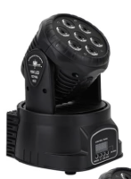
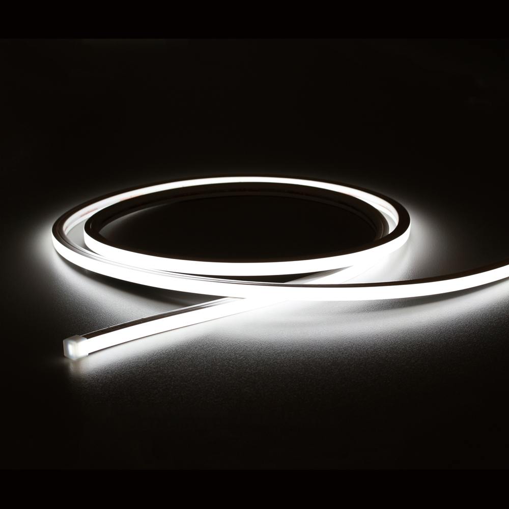

<!DOCTYPE html>
<html>
<head>
  <meta charset="UTF-8">
  <title>照明シミュレーター</title>
  
</head>
<body>

  

    

     <button id="cameraModeButton">📷</button>
     <button id="objectModeButton">💡</button>
    

  

  

   <!-- 通常UI -->
   

    <h3>操作パネル</h3>
    <button onclick="toggleLight()">ON/OFF</button>
    

    <button class="lightButton"
            onclick="addSmartLight()">
      
ムービングライト

      
    </button>
    <button class="lightButton"
            onclick="addTapeLight()">
      
テープライト

      
    </button>
    

    <button onclick="resetScene()">リセット</button>
  

  <!-- 選択時UI -->
  

    <!-- 戻るボタン -->
    <button id="backButton" onclick="backToDefaultUI()">←</button>
    <h3>オブジェクト設定</h3>
    
種類: 

    
位置: 

    
選択中キーフレーム: なし

    <label>色</label>
    <input type="color" id="colorPicker" value="#ffff00">
    

    <label>電源</label>
    <button id="powerButton" onclick="toggleTapeLight()">OFF</button>
    

   

     <label>向き</label> 
     <button onclick="setTapeDirection('left')">← 左</button>
     <button onclick="setTapeDirection('front')">前</button>
     <button onclick="setTapeDirection('right')">右 →</button>
     <button onclick="setTapeDirection('back')">後</button>
       
     <input
       type="range"
       id="rotationSlider"
       min="0"
       max="360"
       value="0"
       oninput="updateRotationSlider(this.value)"
      >
     
0°

   

   

     <label>向き</label> 
     <button onclick="setMovingDirection('left')">← 左</button>
     <button onclick="setMovingDirection('front')">前</button>
     <button onclick="setMovingDirection('right')">右 →</button>
     <button onclick="setMovingDirection('back')">後</button>
       
     <input
       type="range"
       id="movingRotationSlider"
       min="0"
       max="360"
       value="0"
       oninput="updateMovingRotationSlider(this.value)"
      >
     
0°

   

    

    <button onclick="deleteSelectedObject()">削除</button>
  

  

    <button onclick="playTimeline()">▶</button>
    <button onclick="pauseTimeline()">⏸</button>
    <button onclick="stopTimeline()">■</button>
    <input
      type="range"
      id="timeSlider"
      min="0"
      max="60"
      step="0.1"
      value="0"
      oninput="updateTimelineTime(this.value)"
    >
    0.0s
    <input
      type="file"
      id="audioFile"
      accept=".mp3"
    >
  

  

    

    

  

  

    

    

    

  

</body>
</html>